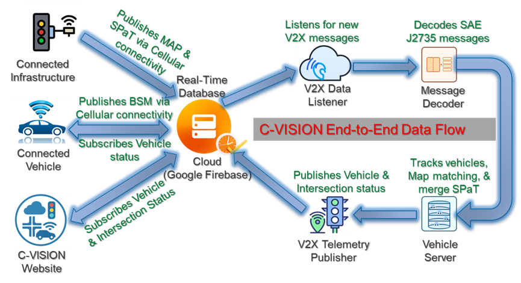

# Cloud-based Vehicle-to-Infrastructure for Smart Intelligent On-road Navigation (C-VISION)

A personal GitHub workspace for experimenting with **Cloud Computing** and **V2I (Vehicle-to-Infrastructure)** related projects.  
This repository serves as a central place for development, testing, and documentation of ongoing work.

---

<p align="center">
  <picture>
    <source media="(prefers-color-scheme: dark)" srcset="docs/images/cvision-architecture-overview-dark.png">
    
  </picture>
</p>
<p align="center"><em>Figure 1 — End-to-end data flow for C-VISION.</em></p>

<details>
<summary><strong>How this maps to the code</strong> (click to expand)</summary>

- **V2X Data Listener** → `src/listener/`
- **J2735 Message Decoder** → `src/decoder/`
- **Vehicle/Map-matching Server** → `src/server/`
- **Telemetry Publisher** → `src/publisher/`
- **Website (frontend)** → `src/web/`

</details>

## 📂 Repository Structure

- **config/** – Configuration files for setting up and running projects  
- **docs/** – Project documentation and references  
- **src/** – Source code for cloud services, V2X data processing, and related tools  

---

## 🚀 Features & Focus Areas

- V2X data handling and decoding  
- SPaT (Signal Phase and Timing) and MAP message forwarding  
- Cloud-based data management and integration  
- Initial setup for traffic controller simulation and testing  

---

## 🛠️ Getting Started

### Prerequisites
- [Node.js](https://nodejs.org/) (latest LTS recommended)  
- [Python 3.x](https://www.python.org/)  
- Firebase CLI (if using Firebase integration)  

### Installation
Clone the repository:
```bash
git clone https://github.com/debipe20/c-vision.git
cd c-vision
```

---

## 📄 License

This project is licensed under the Apache-2.0 License

---

## ✨ Notes

This repository is in active development. Expect frequent changes and experimental features.
Future updates will include more detailed documentation and test cases.
